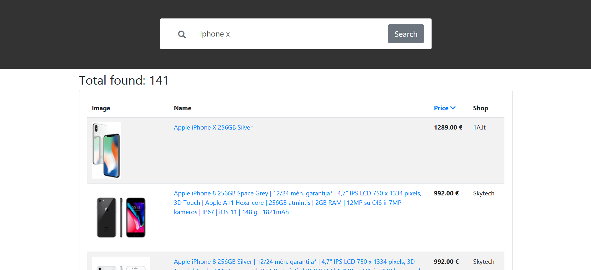

# LT-eshops-search



Simple web crawler. Pass keyword, and crawler will attempt search in registered stores, and returns products. Found products are returned in JSON format.
Example response [can be found here](json_example.json)

If you want just want API (without twig and front end.) [go here](https://github.com/uikolas/LT-eshops-search/tree/api)

Built on **Symfony 4** with:
* [clue/buzz-react](https://github.com/clue/php-buzz-react)
* [symfony/dom-crawler](https://github.com/symfony/dom-crawler)

Install:
```
git clone https://github.com/uikolas/LT-eshops-search.git

composer install
```

If you want to quickly test it.

Then go to public folder and run:
`php -S 127.0.0.1:8000`

And then you can go to:
`http://127.0.0.1:8000/search?keyword=iphone x`

where `keyword` you can pass any keyword for search.